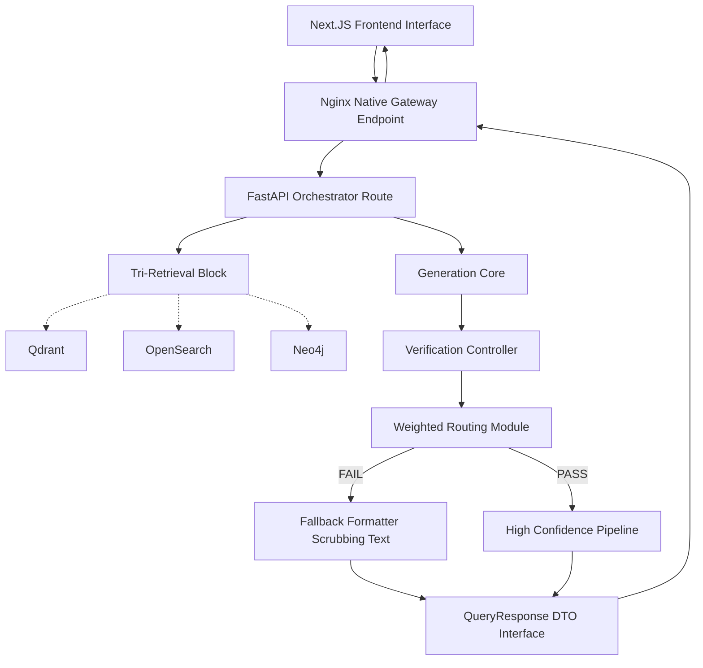

# Architecture

```mermaid
graph TD
    UI[Next.JS Frontend Interface] --> GW[Nginx Native Gateway Endpoint]
    
    GW --> API[FastAPI Orchestrator Route]
    
    API --> RT[Tri-Retrieval Block]
    RT -.-> Qdrant
    RT -.-> OpenSearch
    RT -.-> Neo4j
    
    API --> GEN[Generation Core]
    
    GEN --> VERIF[Verification Controller]
    
    VERIF --> SCORER[Weighted Routing Module]
    SCORER --> |FAIL| FB[Fallback Formatter Scrubbing Text]
    SCORER --> |PASS| PASS[High Confidence Pipeline]
    
    FB --> API_RES[QueryResponse DTO Interface]
    PASS --> API_RES
    
    API_RES --> GW
    GW --> UI
```
